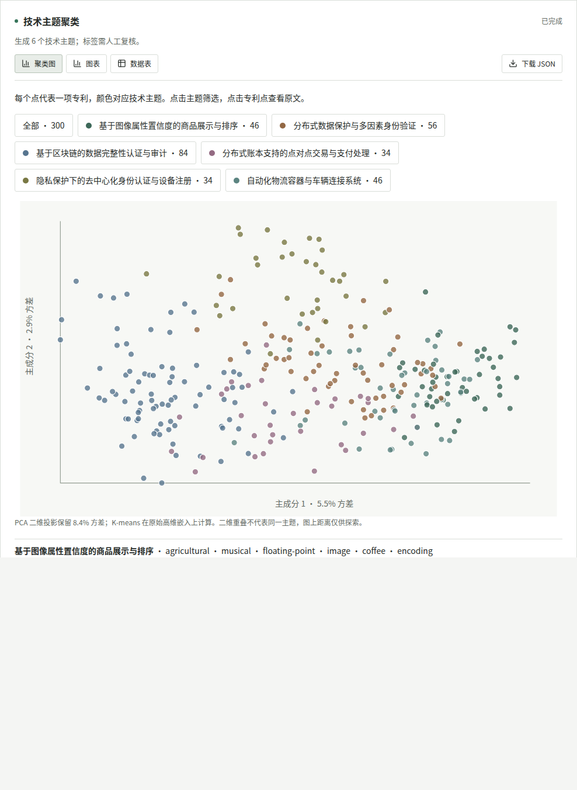

<div align="center">

# Invention Atlas

**Explore patents. Follow the evidence.**

专利检索、技术主题与引证分析，在一个可回查原文的应用中完成。

[快速开始](#快速开始) · [分析能力](#分析能力) · [数据与限制](#数据与限制) · [开发](#开发)

</div>



Invention Atlas 使用真实专利文本开展分析。你可以直接选择工具，也可以用中文提问，让助手规划任务、逐项执行并生成报告。统计和网络由程序计算，模型负责规划、主题归纳与辅助抽取；结果保留数据集版本、参数和来源。

## 从数据到结论

- **检索与原文**：语义检索英文专利，打开摘要、权利要求和说明书，对照来源阅读。
- **主题与布局**：K-means 聚类、PCA 散点图、中文主题名和代表专利；比较申请人技术组合与合作关系。
- **引证与技术路线**：查看真实引证边、共引、文献耦合和引证主路径，点击节点追查原文。
- **可恢复的分析**：逐项展示进度，支持停止、历史恢复及全文抽取断点复用；报告解释失败不会丢失工具结果。
- **保存与导出**：报告保存运行快照，可下载 Markdown、HTML 和工具 JSON。旧报告不随当前数据变化。

灰白查询界面以表格与图形为主，助手按需展开。桌面和手机均可使用；新标签页不会预先展示旧结果。

## 快速开始

需要 **Node.js 22.16 或以上**、npm，以及可访问的模型接口。

```sh
git clone git@github.com:JYao-Chen/invention-atlas.git
cd invention-atlas
npm ci
cp .env.example .env.local
```

在 `.env.local` 设置自己的登录账号、密码和 API Key。以下仅展示配置项，不包含可用凭证。

```dotenv
PATENT_USERNAME=admin
PATENT_PASSWORD=your-own-password
DASHSCOPE_API_KEY=your-dashscope-api-key
PATENT_MODEL=qwen3.8-flash
PATENT_API_BASE_URL=https://dashscope.aliyuncs.com/compatible-mode/v1
PATENT_EMBEDDING_MODEL=text-embedding-v4
PATENT_DATA_DIR=./data
```

```sh
npm run data:fetch
npm run data:index
npm run dev
```

打开 **http://127.0.0.1:3017**，用刚设置的账号登录。下载需要网络；建立索引和模型分析会产生 API 费用。已完成的向量索引不会重复请求。

也可在数据页导入自己的专利文件。支持规范化 JSONL、Google Patents JSONL、USPTO XML 和 Derwent/WoS 文本；字段缺失会限制对应工具。

### 模型设置

登录后在“模型与设置”修改对话模型、OpenAI 兼容接口地址和 API Key。测试连接不会自动保存，保存后新请求生效。密钥仅存服务端，不在设置接口回显；Key 留空保留已有密钥。

语义索引单独使用百炼 `text-embedding-v4`，1024 维。更换对话模型不会更换嵌入空间。其他接口的模型名须由提供商实际支持。

### 试一个问题

> 分析当前数据集的主要申请人、技术主题和代表专利，展示引证关系，拆解一项代表专利的权利要求，并生成报告。

也可先运行“技术主题聚类”。每个点是一项专利，颜色对应原始高维空间中的聚类；中文名称依据关键词和代表专利摘要归纳，并保留归纳证据，供人工复核。

## 分析能力

24 项工具可直接点选，可用性取决于当前记录包含的真实字段。

| 能力组 | 工具与方法 |
|---|---|
| 检索与读取（2） | BM25／嵌入余弦检索、专利详情 |
| 数据与态势（5） | 数据概况、公开趋势、Logistic 生命周期拟合、IPC 分布、公开局分布 |
| 热点与主题（4） | 词频与 TF-IDF、Kleinberg 突现、年度关键词、K-means 聚类及 PCA 可视化 |
| 竞争格局（4） | 合作网络、竞争者演化、申请人组合、CR3/5/10 与 HHI 集中度 |
| 技术路线（1） | 内部引证 DAG 的 SPC 主路径 |
| 价值与机会（2） | 引证指标 Pareto 筛查、原文证据支持的技术效果矩阵 |
| 引证与同族（2） | 引证网络／共引／耦合、已有同族成员的地域分布 |
| 审计与监测（2） | 检索策略返回集对比、本地数据变化基线 |
| 法律与权利要求（2） | 来源时点法律状态、权利要求要素与原文定位 |

## 数据与限制

获取脚本从 [ExponentialScience/DLT-Patents](https://huggingface.co/datasets/ExponentialScience/DLT-Patents) 的 6 个分散位置各读取 100 条候选，排除截断、重复和必要字段缺失记录，再等距选取 **300 条真实专利**。保留公开编号、原文与来源，不以合成记录补足。

这是非随机样本，**不代表全球专利总量或行业增长趋势**。语料含跨领域记录，研究特定领域前应先检索筛选。申请人与受让人分开处理，IPC 和 CPC 不混用。

可选执行 `npx tsx scripts/enrich-public.ts`，为 10 项代表记录获取 Google Patents 公开页面中的状态与同族信息。第三方页面可能变化或限制访问；补充信息是获取时点的快照，不能作为官方有效性确认或完整全球同族。原始样本默认没有这些字段。

- 聚类名称是模型辅助解释，需核对代表专利；PCA 二维距离不能完整反映高维语义距离。
- 引证与主路径只反映记录中可观察到的关系，不能据此断言技术因果。
- 价值筛查比较透明指标，不输出单项专利交易价格或商业估值。
- 变化监测比较已导入记录与本地基线，不持续检索全球新申请。
- 权利要求抽取有逐字原文定位检查，但不替代专利专业人员判断。法律状态和报告均不构成法律意见。

数据、模型服务和字体遵循各自来源条款。仓库不附带本地数据库、Google 页面缓存、登录凭证或 API Key。获取数据不意味着获得实施相关专利的权利。

## 架构

```text
Next.js App Router + React + TypeScript
  ├─ 查询界面、原文阅读、图表、历史与报告
  ├─ LangGraph：Planner → Search / Claim / Citation / Statistics → Report
  ├─ TypeScript 分析工具 + 服务端模型调用
  └─ SQLite：专利、任务、事件、对话、报告与监测基线
```

单体应用，不需要 Python 服务、Redis 或独立 Agent 部署。任务事件通过 SSE 传输，模型报告增量输出 Markdown，工具数据独立保存。

## 开发

```sh
npm test
npm run typecheck
npm run build
npm start
```

普通单测不需要模型调用。真实数据核对测试在本地源缓存存在时执行，缺缓存会明确跳过；下载样本和可选补充后可再核对。模型输出具有不确定性，单测通过不等于分析结论经过专业认证。

```text
src/components/   查询界面、散点图、网络图、原文与进度
src/server/       分析算法、模型调用、导入、任务与 SQLite
src/lib/          数据类型与推荐问题
scripts/          样本获取、索引及可选公开信息补充
tests/            算法、导入、证据定位、流式协议等测试
data/             本地运行数据（不提交）
```

默认仅监听回环地址。公网使用前请配置 HTTPS、独立登录凭证与持久数据目录，并在模型提供商设置费用限制。应用为单账号设计，不提供多租户权限隔离。

## 贡献

欢迎提交带有复现步骤的 Issue 或 Pull Request。修改算法请附小型测试和字段依据；新增分析需说明缺失数据如何处理。不要提交未授权数据或真实密钥。

## 许可证

代码采用 [MIT License](LICENSE)。字体保留其 SIL Open Font License；专利数据和第三方页面内容不因代码许可证而重新授权。
