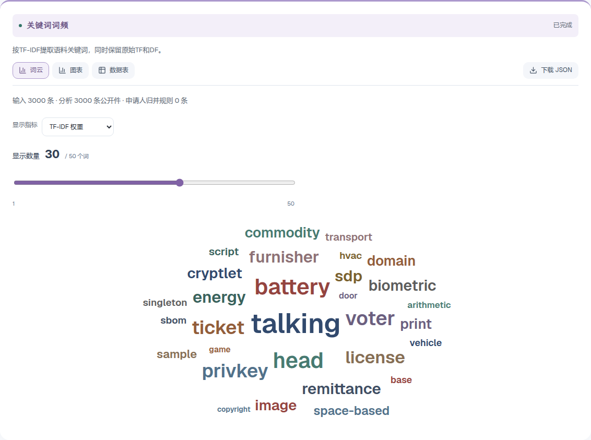
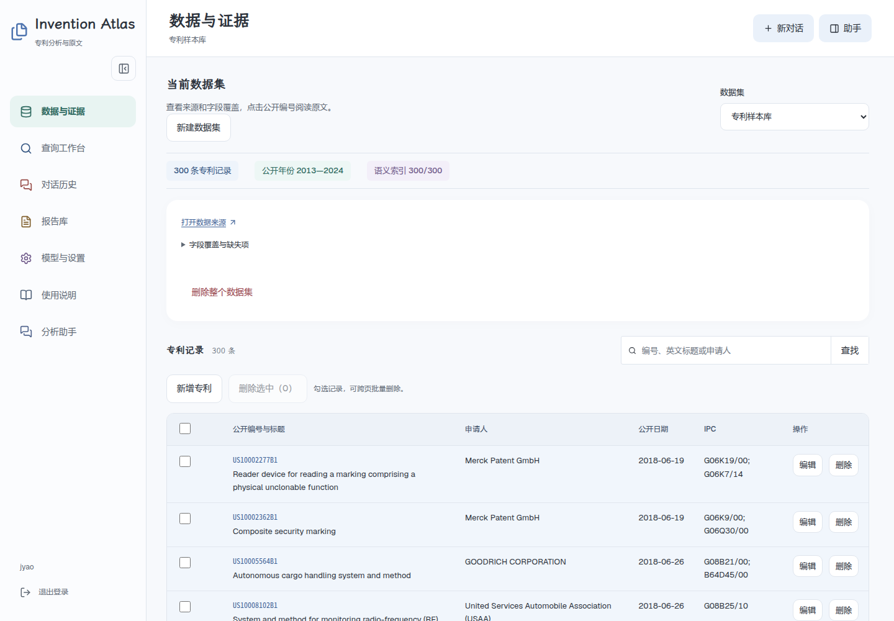
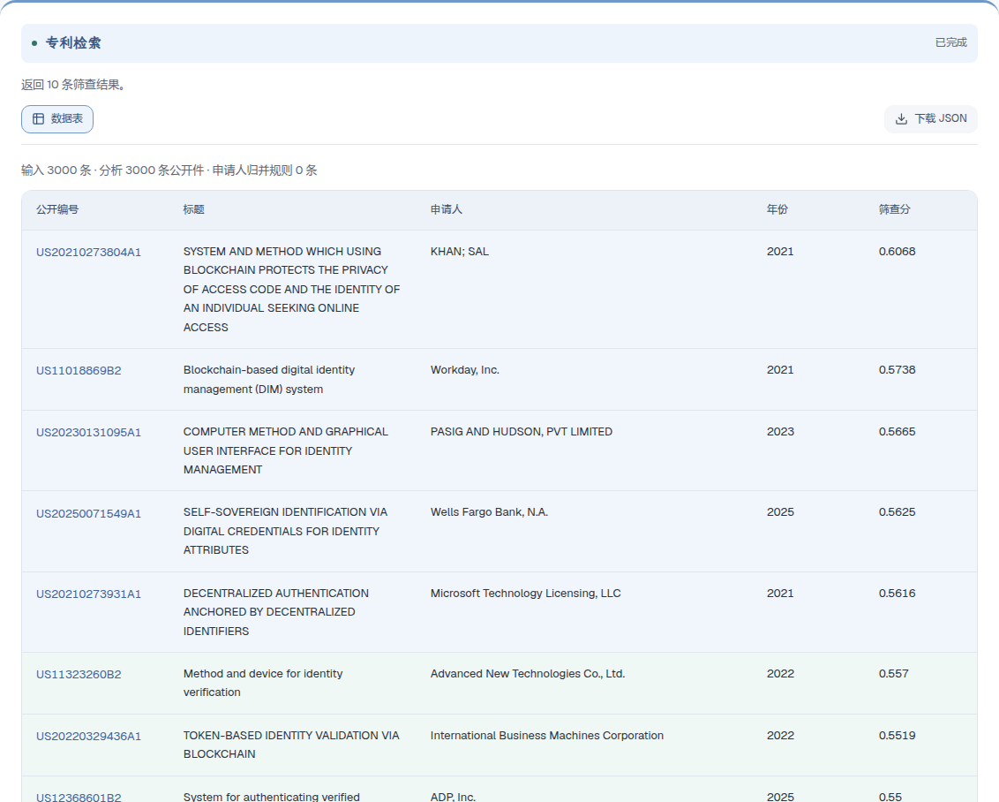
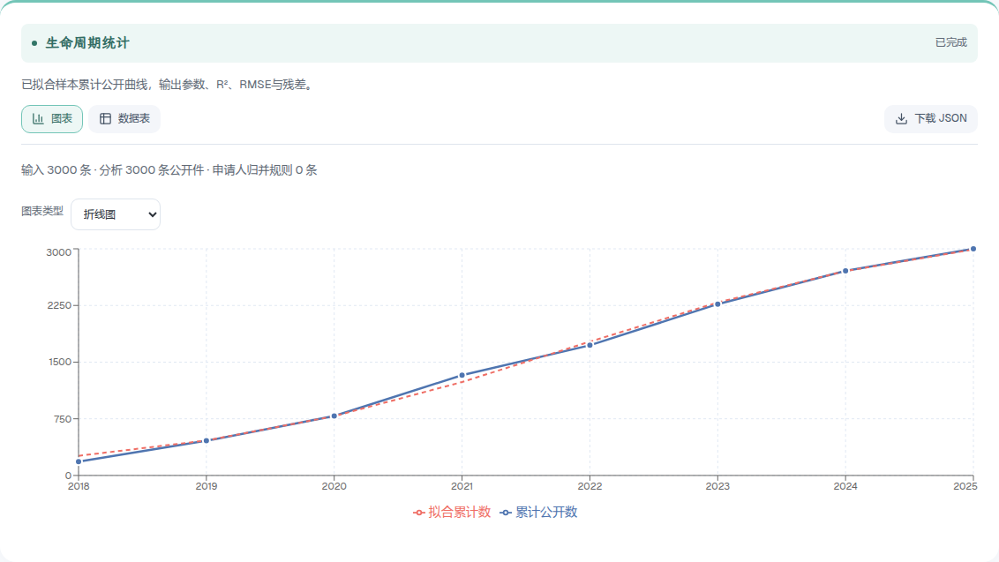
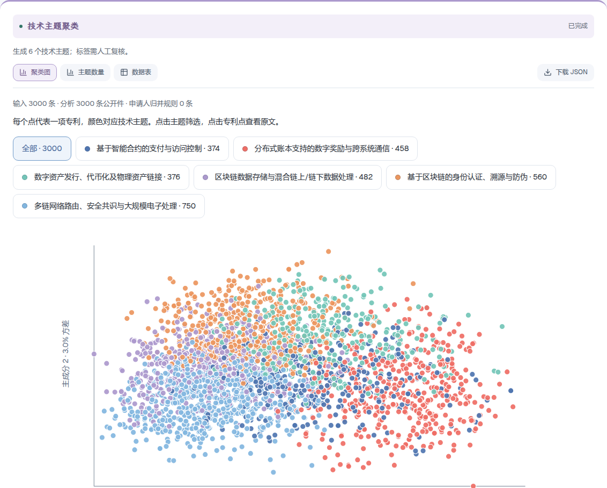
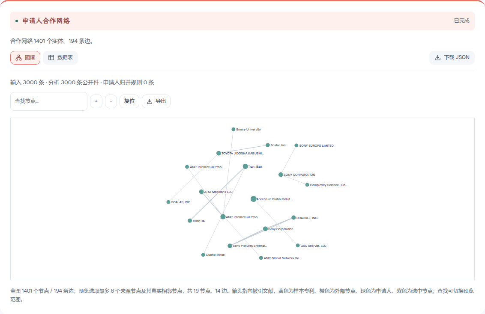
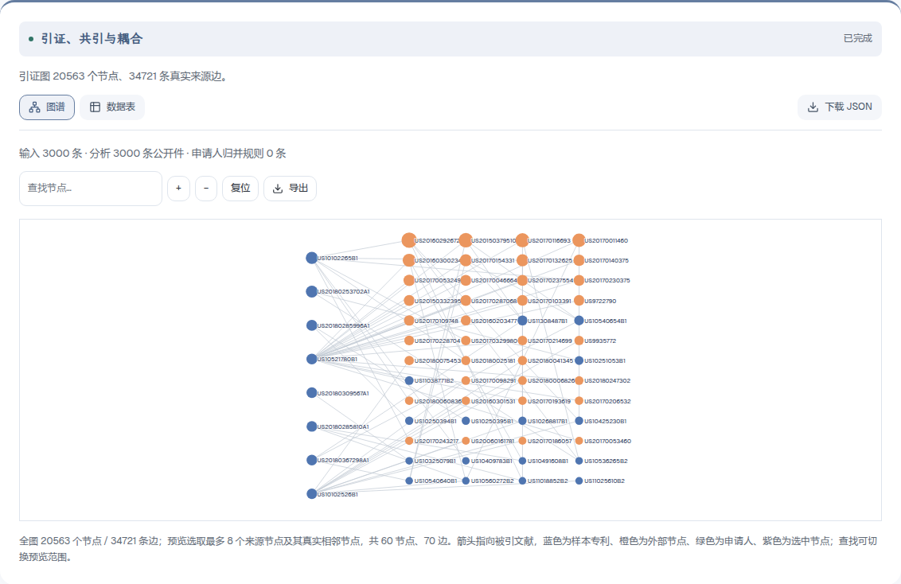
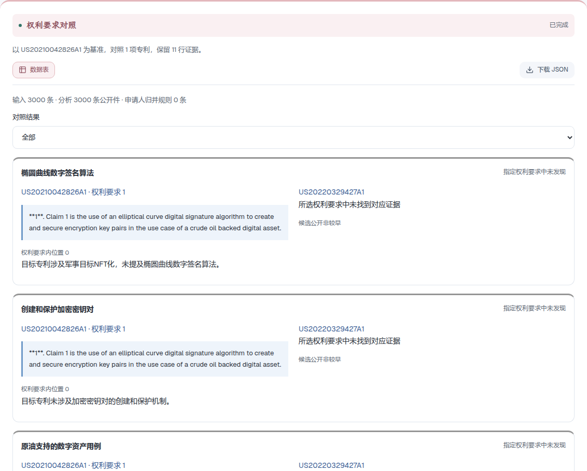

<div align="center">
  
  <h1>Invention Atlas</h1>
  <p>专利检索、统计分析与文本挖掘</p>
  <p><a href="https://patent.jyaochen.cn">在线应用</a> · <a href="docs/USER-GUIDE.md">使用说明</a> · <a href="#09-安装与配置">安装与配置</a> · <a href="LICENSE">MIT License</a></p>
</div>

Invention Atlas 面向已入库专利的研究分析。系统通过检索确定研究范围，计算文献的时间分布和主体结构，再结合技术主题、引证关系及权利要求组织报告。公开编号连接计算结果与原文，便于核对代表文献及具体技术措施。

查询工作台提供 26 项工具的参数表单和独立执行入口；分析助手根据自然语言安排工具，将执行计划、结构化结果和模型解释分别保存。统计与图网络由 TypeScript 程序计算，模型用于规划、主题命名及全文辅助抽取。



## 目录

- [01 数据准备与研究范围](#01-数据准备与研究范围)
- [02 专利检索与原文阅读](#02-专利检索与原文阅读)
- [03 公开活动与技术分类](#03-公开活动与技术分类)
- [04 关键词与技术主题](#04-关键词与技术主题)
- [05 申请人结构与竞争格局](#05-申请人结构与竞争格局)
- [06 引证关联与代表文献](#06-引证关联与代表文献)
- [07 同族资料与全文分析](#07-同族资料与全文分析)
- [08 综合分析与报告](#08-综合分析与报告)
- [09 安装与配置](#09-安装与配置)
- [10 开发与部署](#10-开发与部署)
- [11 文档与许可](#11-文档与许可)

## 01 数据准备与研究范围

数据导入支持规范化 JSONL、Google Patents JSONL、USPTO XML 及 Derwent/WoS 文本。系统保留来源，按公开编号去重，分别保存 IPC 与 CPC，以及申请人和受让人。缺少字段保持缺失，不以推测内容补齐。

数据概况汇总记录数、公开年份和字段覆盖率，用于判断后续方法是否具备输入条件。质量审计检查必要字段、日期及重复编号，并核对已有权利要求的原文偏移。同一专利可以产生多项问题，异常行数不能作为异常专利数。



记录支持新增、编辑和删除，可勾选跨页记录批量删除，也可删除整个数据集。语义索引按批保存进度，停止后可继续处理未完成记录。标题或摘要修改后，需要重建该条向量；数据修改不会重算已保存报告。

分析可以限定公开年份、申请人及 IPC。公开件口径保留各公开版本；同族代表件按来源标识归组，选取范围内最早公开件，缺标识的记录独立保留。跨工具比较应保持范围和口径一致。

当前在线专利库包含 3000 条区块链相关公开文献，覆盖 2018—2025 年，来源为 [ExponentialScience/DLT-Patents](https://huggingface.co/datasets/ExponentialScience/DLT-Patents)。资料经定向筛选，未构成全球或行业总体样本。仓库不包含线上数据库，部署后需自行导入或获取资料。完整同族和法律状态仅在具有来源资料的记录中提供。

## 02 专利检索与原文阅读

专利检索建立与技术问题相关的候选集合。系统将问题转为嵌入向量，按标题摘要向量的余弦相似度排序，支持中文问题检索英文文献。运行前需建立索引；返回数量限制候选集规模，不能解释为全部命中数。

输入技术对象或用途，设置范围及返回数后执行。相关性排序需要结合标题摘要核对；用于特定领域的后续统计应针对候选集计算，避免把全库结果作为该领域结论。

检索策略比较使用 BM25 词法匹配，对多组表达计算交集和独有命中。保持范围及返回数一致，打开差异文献判断补充术语的作用。没有完整相关文献标注时，集合重合率不能替代查全率。



专利详情按公开编号读取摘要、权利要求和说明书，同时显示已有分类及来源链接。点击结果编号或图谱节点可打开详情。申请公开与授权公开属于不同版本，条款应分别阅读。

## 03 公开活动与技术分类

公开趋势按公开日期统计数量，用于描述语料中的公开活动。设置时间粒度和年份范围后，通过图表比较分布。缺失年份、部分年度及采集范围会影响曲线，样本下降不能直接解释为技术衰退。

生命周期统计对年度累计公开量进行 Logistic 拟合，至少需要六个有记录的公开年。比较观测量与拟合曲线时，应检查参数和误差；结果不提供行业规模预测，也不能单凭曲线判断技术成熟阶段。



IPC 分布整理技术分类构成，CPC 不混入统计。选择分类层级后查看频次与对应文献。一项专利可以含多个分类，计数之和不必等于记录数。公开局分布按编号前缀统计文献来源地域，不能作为企业国籍或当前有效权利地域。

## 04 关键词与技术主题

关键词词频从标题摘要提取 TF-IDF 关键词，同时保留原始词频 TF 和文档频次 DF。词云用于观察术语分布，柱状图及数据表用于核对数值。显示指标可以切换，数量滑块调整已有结果的可视项数，点击词语查看指标。高权重反映当前语料中的区分作用，不自动代表核心技术。

年度关键词在各公开年提取高权重术语，用于比较文本关注点。范围内全部文献参与计算，结果行是归纳后的“年份—关键词”组合。例如八个年份、每年十词对应八十行结果，并非仅分析八十项专利。

关键词突现识别词语在时间序列中的集中出现，供研究阶段性关注变化。读取结果应同时核对词频、区间及对应文献，稀疏年份和少量记录可能影响突现结果。

主题聚类使用标题摘要嵌入向量与固定种子的 K-means。设置主题数后，模型结合组内关键词及代表文献命名。PCA 投影形成二维散点图；颜色对应主题，点击主题可筛选，点击专利点读取原文。投影会损失距离信息，交叠不能单独证明聚类失败，分离也不能证明存在独立技术路线。



## 05 申请人结构与竞争格局

申请人组合比较主体在技术分类中的分布，用于识别集中方向及跨领域布局。竞争者演化按年份追踪主体公开活动，描述语料内的主体结构变化。比较前需核对名称归并，数量排名不等于技术实力排名。

申请人集中度计算 CR3、CR5 和 HHI，分别描述头部主体份额与整体集中程度。有效主体数由 Shannon 熵的指数计算。指标只针对当前语料及计数口径，不作为市场份额或反垄断判断。

合作网络依据同一公开件中共同出现的主体建立连接。选择主体类型后检查节点与边权，并读取共同申请文献。共同申请不证明股权、业务联盟或长期战略关系。



## 06 引证关联与代表文献

引证网络保存来源中的真实引用边，区分样本内部文献和外部对象。节点及边用于追踪引用关系，再回到原文核对语境。内部被引数和 PageRank 受样本边界影响，不能替代完整专利库中的影响力评价。

共引分析寻找被同一文献共同引用的对象；文献耦合比较共享引用对象的文献。两者分别描述共同被引与共同引用关系，用于组织关联阅读。关系强度需要结合共享数量及内容解释，不直接证明技术等价。



引证技术主路径将合格内部引用整理为时间有序图，通过 SPC 路径权重提取连接，用于安排技术文献阅读次序。自引及不符合时序的边不参与计算。没有合格内部边时返回数据不足，不以年度主题替代引证路径。

引证指标筛查依据内部被引数和 PageRank 进行 Pareto 非支配分层，整理进一步阅读对象。同层不声明价值高低，层级也不等于商业价值等级。系统不计算交易价格，组合交易金额不能分摊为单项估值。

## 07 同族资料与全文分析

同族地域分析按来源成员编号统计公开局，保留文献与成员对应关系。同族标识用于归组，成员列表用于地域分析；只有标识而没有成员时不能推断完整布局。存在某局公开件不等于该地域当前有效。

法律状态统计整理来源获取时点的状态及事件，仅覆盖具有资料的子集，缺失记录保持未知。获取日期、事件日期和预计到期日分别保存。第三方推定状态不能视为官方效力确认。

权利要求要素抽取读取指定公开版本和条款中的技术特征，保留连续引句及原文偏移。可以选择条款号，长文本按段处理并保存完成段。定位成功仅证明出处，特征含义仍需结合完整条款判断。

权利要求对照以第一项编号为基准，比较其他文献，提供双侧引句与匹配结果。对象应具有相近技术内容，明确版本及条款范围。未发现对应要素仅限已读取条款，不等于整个现有技术中不存在该特征。



技术效果矩阵读取摘要、权利要求及说明书，分段提取明确陈述的措施—效果关系，保留原文证据。相同参数重跑复用已完成段；部分完成不能作为全文覆盖。矩阵表达来源声明，未独立验证效果，也不以预设关键词共现代替抽取。

这些工具用于技术研究，不提供侵权、新颖性或自由实施法律意见。

## 08 综合分析与报告

助手通过应用内部注册的工具及 LangGraph 流程执行任务，当前没有独立对外 MCP 服务。自然语言先形成计划，再执行检索、统计或全文工具，报告依据已完成结果生成。明确指定的工具保留在计划中，范围和参数随运行保存。

可以输入一项综合研究问题。

> 分析当前数据集的主要申请人、技术主题和代表专利，展示引证关系，并拆解一项代表专利的权利要求，生成报告。

先检查数据概况和分类构成，再阅读主体及主题结果，利用引证关系选择代表文献，最后核对权利要求与报告中的证据。工具数据和正文独立保存，报告生成失败后可以只重试报告，无需重复完成的计算。


数据变化监测按固定检索表达、策略 ID 和范围建立基线，比较后续返回集合及字段。首次建立基线不把全部记录记作新增，零变化是正常结果。该功能比较入库资料，不持续搜索互联网新申请。

对话历史从助手进入，分页恢复已保存任务。报告库支持保存结果及 Markdown、HTML 导出。历史报告保留当次快照，不随切换数据集改变，历史运行明确标记。

回答完成后，模型结合当前问题、已有回答和可用工具生成五个相关追问。建议按 JSONL 流式解析，每完成一条即显示一条。点击可填入输入框，修改后再发送；“换一组”重新生成不同角度的建议。建议随对话保存，生成失败保留已返回项，不影响已完成的报告。

系统内“使用说明”依研究流程编排 33 个编号章节，结合电脑和手机截图介绍功能。章节按钮可打开工具或填入示例问题。询问“生命周期统计的计算方法和用途”会依据说明书回答，标记为功能说明，不执行数据分析。

<details>
<summary>手机界面</summary>


</details>

## 09 安装与配置

需要 Node.js 22.16 或以上及 npm。

```sh
git clone git@github.com:JYao-Chen/invention-atlas.git
cd invention-atlas
npm ci
cp .env.example .env.local
```

在 `.env.local` 设置自己的账号和模型凭证，勿提交该文件。

```dotenv
PATENT_USERNAME=admin
PATENT_PASSWORD=your-own-password
DASHSCOPE_API_KEY=your-dashscope-api-key
PATENT_MODEL=qwen3.8-flash
PATENT_API_BASE_URL=https://dashscope.aliyuncs.com/compatible-mode/v1
PATENT_EMBEDDING_MODEL=text-embedding-v4
PATENT_DATA_DIR=./data
```

```sh
npm run dev
```

打开 [http://127.0.0.1:3017](http://127.0.0.1:3017)。在“模型与设置”保存并测试连接，随后导入资料和建立索引。对话模型支持 OpenAI 兼容接口，名称应由提供商实际支持；语义索引使用独立的百炼嵌入配置。API 费用由对应提供商收取。

数据页可按源位置分批获取 DLT 公开语料。服务器无法直连时，可设置 `PATENT_DATASET_ROWS_URL` 为自管 `/rows` 转发地址。命令行 `npm run data:fetch` 直接请求官方接口，获取原始 300 条样本，已有该来源资料时不重复导入。`npm run data:index` 为当前数据集建立索引。这些命令不下载线上 3000 条数据库。

## 10 开发与部署

```sh
npm test
npm run typecheck
npm run build
npm start
```

应用采用 Next.js App Router、React、TypeScript、LangGraph 和 SQLite，不需要 Python 服务、Redis 或独立 Agent 服务。任务事件通过 SSE 传输，模型密钥只由服务端读取。当前采用单账号登录，未提供多租户权限体系。

```text
src/components/   页面、表单、图表与使用说明
src/server/       工具计算、模型调用、任务与数据库
src/lib/          类型、说明书与结果布局
scripts/          数据获取、索引与验证脚本
tests/            算法与流程测试
public/brand/     品牌 Logo
public/help/      电脑与手机截图
data/             私有运行数据，不提交 Git
```

公网部署需配置 HTTPS，将数据库及模型配置放在发布目录之外。更新后切换独立版本，保留上一可用版本用于回滚。具体配置见[开发与部署说明](docs/DEVELOPMENT.md)。

使用说明维护在 `src/lib/help-guide.ts`，运行 `npx tsx scripts/prepare-help.ts` 同步仓库文档。截图来自真实保存结果，更新流程见[说明与截图维护](docs/DEVELOPMENT.md#更新说明与截图)。测试记录反映指定数据和参数下的验证情况，不表示模型解释获得专业认证。

## 11 文档与许可

| 文档 | 内容 |
| --- | --- |
| [使用说明](docs/USER-GUIDE.md) | 研究流程、26 项工具、解读与截图 |
| [工具参考](docs/TOOLS.md) | 参数及结构化结果定义 |
| [开发与部署](docs/DEVELOPMENT.md) | 导入格式、配置和持久化 |
| [研究流程](docs/RESEARCH-WORKFLOW.md) | 候选范围传递与原文定位 |
| [工具验收](docs/ACCEPTANCE-20261009.md) | 工具及推荐问题实际验证 |
| [研究能力验收](docs/ACCEPTANCE-RESEARCH-20261009.md) | 全文流程与验证范围 |
| [图表配色](docs/JOURNAL-PALETTE.md) | 功能及图表颜色约定 |
| [品牌资源](public/brand/README.md) | Logo 文件与生成说明 |

提交 Issue 请附范围、参数及复现步骤。修改工具计算应提供小样本测试，说明必要字段和数据不足时的行为。请勿提交密钥或未授权资料。

代码采用 [MIT License](LICENSE)。导航和对话布局参考 [TallyBear](https://github.com/JYao-Chen/tallybear)，字体授权随资源保留。数据及第三方页面遵循各自条款，代码许可不改变资料授权，也不授予实施相关专利的权利。
