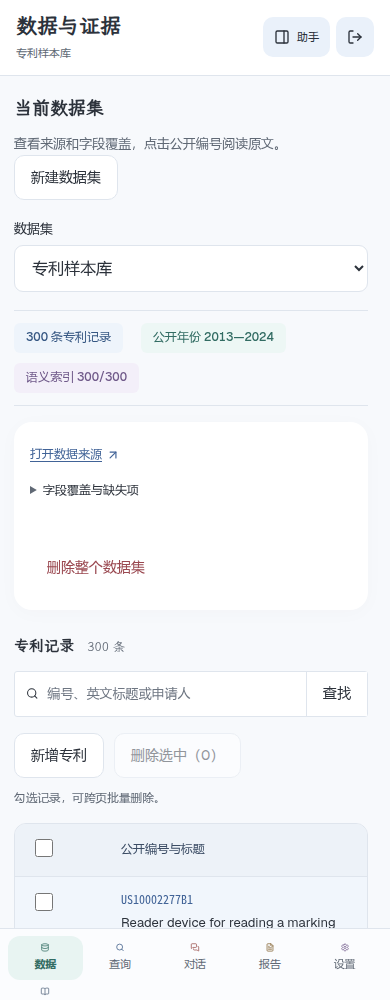
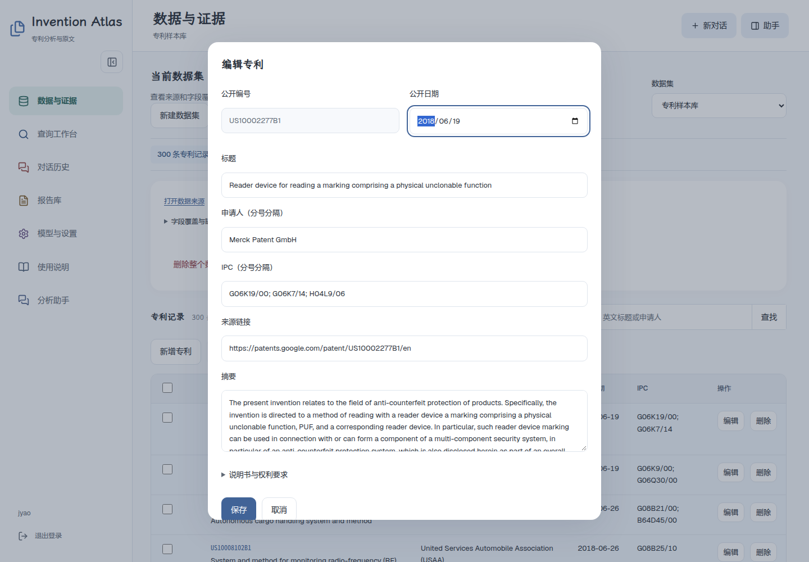
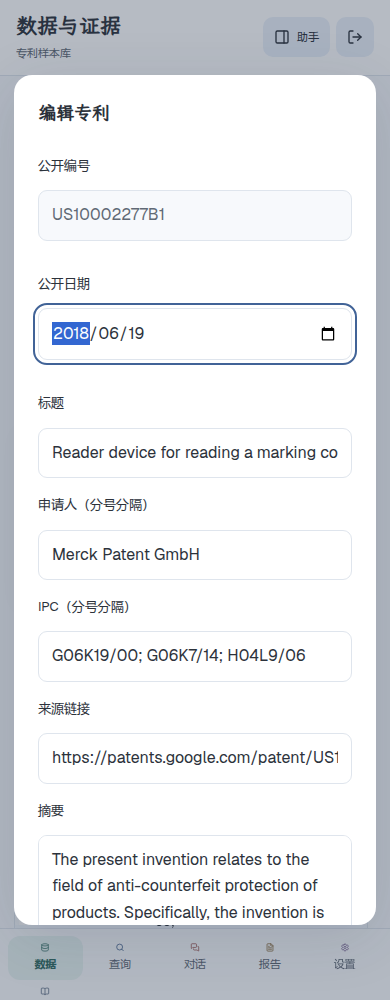
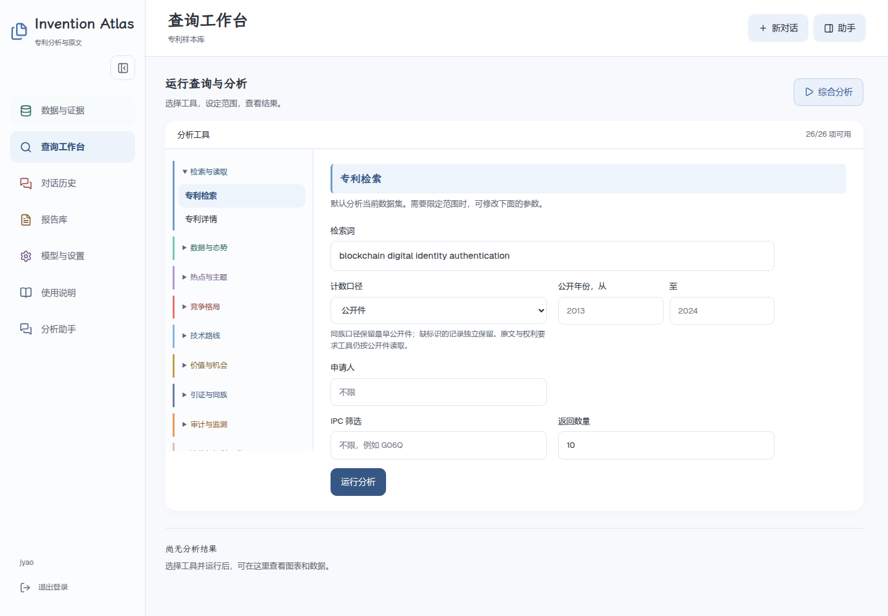
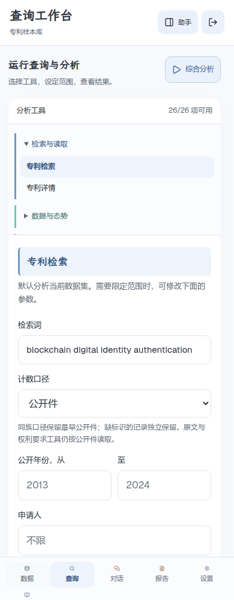
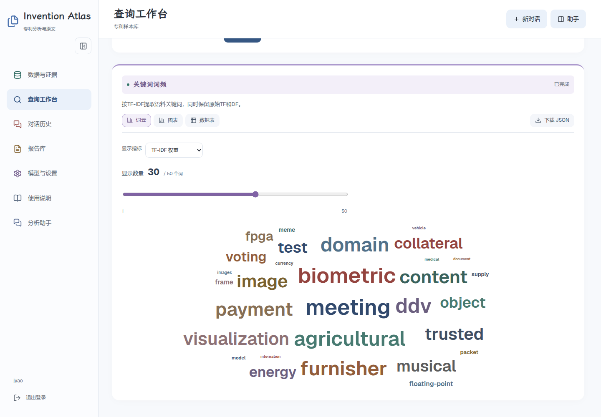
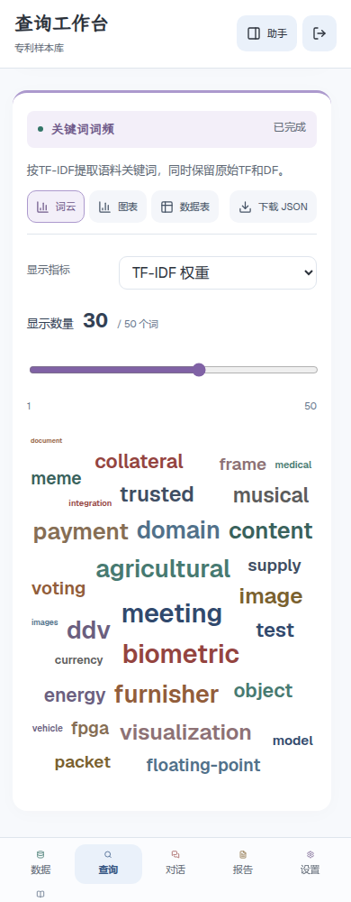
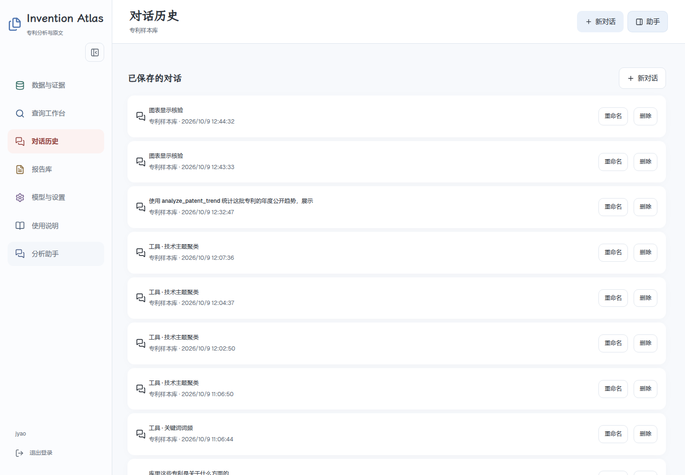

# Invention Atlas 使用说明

应用内从“使用说明”进入。目录可搜索，功能按钮打开页面，演示问题需主动发送；截图可切换电脑与手机并查看大图。以下应用链接指向默认本地入口，其他部署可将地址替换为自己的域名。

- [开始使用](#start)
- [导入与获取专利](#data)
- [新增、编辑与批量删除](#manage)
- [语义索引与来源补充](#index)
- [选工具并填写参数](#tools)
- [词云、聚类与图谱](#charts)
- [助手、进度与恢复](#assistant)
- [对话历史与报告](#history)
- [模型配置与排查](#settings)
- [五分钟演示](#demo)

# 开始使用

先准备数据和模型，再运行第一次分析。

[打开应用中的本章](http://127.0.0.1:3017/#guide/start)（需要登录）

## 第一次打开

1. 使用部署者设置的用户名和密码登录。
2. 在“数据与证据”选择数据集。没有数据时，导入文件、获取公开语料，或新建空数据集后逐条录入。
3. 打开“模型与设置”，填写模型名称、兼容接口地址和 API Key，测试连接后保存。
4. 返回数据页建立语义索引，再到查询工作台选一个工具。

数据集决定本次分析读取哪些记录。对话绑定创建时的数据集，报告保存当次运行的结果快照。

## 页面怎么分工

| 入口 | 用途 |
| --- | --- |
| 数据与证据 | 导入、采集、编辑专利和建立索引 |
| 查询工作台 | 选择工具、填写参数、查看结果 |
| 分析助手 | 提问、查看计划和流式报告 |
| 对话历史 | 恢复已保存的任务与结果 |
| 报告库 | 查看和导出保存的报告 |
| 模型与设置 | 配置并测试对话模型 |

电脑侧栏可以折叠；手机底部导航可以横向滚动。使用说明里的功能按钮只切换页面，不保存数据。

手机截图

---

# 导入与获取专利

文件导入和公开语料采集都会形成独立数据集。

[打开应用中的本章](http://127.0.0.1:3017/#guide/data)（需要登录）

## 导入文件

1. 展开“导入数据集”，填写名称。
2. 选择规范化 JSONL、Google Patents JSONL、USPTO 授权 XML 或 Derwent/WoS。
3. 选择对应文件，点击“导入并检查字段”。
4. 检查数量和字段覆盖率，再建立索引。

扩展名不能替代格式转换。规范化 JSONL 的每行是一项专利，字段示例见仓库的数据格式文档。重复公开编号在导入时合并，缺失字段保留为空。

## 获取公开语料

打开“获取公开专利语料”，填写数据集名称、起始源位置和批次数。每批读取100条候选，最多10批；可填英文检索词筛选这批候选。点击“获取并导入”后查看实际读取进度，也可停止。

该入口读取 ExponentialScience/DLT-Patents，检索词不会触发全球实时专利搜索。过滤后可能不足100条，也可能没有结果。已读取窗口会缓存，重试相同位置可复用。

## 来源与字段

“打开数据来源”和专利详情中的链接可回到来源。申请人与受让人分开保存，IPC 与 CPC 分列。公开日期用于趋势统计，不能当作申请日期。

原始300条样本来自公开语料的分散位置，属于非随机抽样，含跨领域记录。研究一个领域前先检索筛选，不把样本数量当成整个行业数量。

手机截图

---

# 新增、编辑与批量删除

用表单维护记录，删除前核对当前数据集和选中数量。

[打开应用中的本章](http://127.0.0.1:3017/#guide/manage)（需要登录）

## 新增与编辑

1. 点击“新增专利”，填写公开编号、标题与已知字段；或点击某行“编辑”。
2. 申请人和IPC可以填写多个值。权利要求在下方逐项新增，保留编号和正文。
3. 核对来源链接，点击“保存”。取消不会修改记录。

公开编号在编辑时不可更改。标题或摘要变化会清除该条旧向量；申请人等其他字段调整不要求重建该条语义索引。说明书或权利要求变化会清除相关抽取缓存。

## 查询与删除

用编号、英文标题或申请人筛选记录。勾选行首复选框，可跨页保留选择；“选择本页记录”只选择当前页。点击“删除选中”，核对数量后确认。每行也可单独删除。

“删除整个数据集”会移除整批专利和索引，并保留已保存的对话与报告。被删记录无法再从该数据集打开原文。界面不提供撤销，请先确认目标；需要备份时先由部署者备份数据库。

## 为什么暂时不能修改

同一数据集正在索引、来源补充或执行分析时，写入操作会被阻止。等待任务完成，或先停止任务，再编辑或删除。

## 申请人归并与数据审计

在数据整理面板填写别名、规范名称和依据，确认后用于统计。规则只作直接映射，不自动推断集团关系，原始申请人和受让人不改写。

运行“数据质量审计”检查字段与原文定位。计数口径选同族代表件时，使用来源同族标识保留范围内最早公开件，缺少标识的记录独立保留。

手机截图

---

# 语义索引与来源补充

索引进度按已保存的向量计数，停止后可以继续。

[打开应用中的本章](http://127.0.0.1:3017/#guide/index)（需要登录）

## 建立索引

1. 在数据页点击“建立语义索引”。
2. 查看已完成数、总数和百分比。
3. 需要暂停时点击停止，完成的批次会保留。
4. 再次执行只补缺少向量的记录，每10条完成后保存。

索引使用百炼 text-embedding-v4，当前为1024维。没有索引仍可使用词法检索；中文问题检索英文专利建议先完成索引。空数据集不能建立索引，全部完成后不再显示建立按钮。

## 补充公开信息

数据整理面板可按公开编号获取 Google Patents 的公开页面，每批最多10项。查看进度和失败原因，必要时停止或重试。补充的是获取时点的来源快照，不保证最新官方法律状态或完整全球同族。

## 费用与模型

建立索引和模型分析会产生接口费用。修改对话模型不会改变已有嵌入空间；更换嵌入模型需要部署者处理索引，不应把不同模型的向量混在一起。

---

# 选工具并填写参数

直接运行工具时，分析范围和参数由你决定。

[打开应用中的本章](http://127.0.0.1:3017/#guide/tools)（需要登录）

## 运行一个工具

1. 在左侧展开能力组，选择工具。
2. 设置公开年份、申请人或IPC范围；不填写则使用默认范围。
3. 填写该工具的专用参数，例如主题数量、关键词数量或合作主体。
4. 点击“运行分析”，查看进度和结果。

不可用工具会说明缺少哪些字段。空结果不会自动扩大到整个数据集。

## 常用参数

| 参数 | 会改变什么 |
| --- | --- |
| 公开年份、申请人、IPC | 输入记录范围 |
| 计数口径 | 按公开件统计，或按来源同族标识保留代表件 |
| 关键词数量 | 后台返回的关键词数；年度关键词按每年计算 |
| 主题数量 | K-means 的聚类数 |
| 时间粒度 | 年度或月度序列 |
| 合作主体 | 按申请人或发明人构建网络 |
| 专利与权利要求编号 | 要读取或拆解的原文范围 |
| 检索策略 | 对比各策略命中及建立监测基线 |

显示数量滑块只改变已有结果的展示。如果需要更多候选词，请先提高工具的关键词数量，再运行。

手机截图

---

# 词云、聚类与图谱

图表和数据表来自同一份工具结果，可以切换查看。

[打开应用中的本章](http://127.0.0.1:3017/#guide/charts)（需要登录）

## 词云与关键词图

选择“词云”或“图表”，切换TF-IDF、原始词频等可用指标。拖动“显示数量”滑块增减显示词数，上限为当前结果中的词数；年度关键词先选择公开年份。切换不会重新调用模型。

点击词云中的词可以查看数值。柱状图和横向条形图用于比较数值，词云字号用于快速浏览。下载JSON保留完整结果。

## 技术主题聚类

每个点对应一项专利，颜色对应主题。点击主题筛选，点击专利点打开原文。主题名称由模型根据关键词和代表摘要归纳；模型失败时查看关键词和原文，不把编号当成技术解释。

聚类在嵌入空间计算，散点图使用PCA投影。二维距离会丢失信息，不能仅凭点的远近判定技术相似性。

## 引证与合作网络

图谱显示已存在的关系边。可查找节点、放大或缩小、点击节点查看详情。内部专利能打开原文，外部引用仅有标识时链接到公开文献。

引证主路径反映当前记录内可观察的连接，不证明技术因果。字段缺失时不会补造边。

手机截图

---

# 助手、进度与恢复

助手规划工具，程序执行分析，模型流式写出报告。

[打开应用中的本章](http://127.0.0.1:3017/#guide/assistant)（需要登录）

## 提问与计划

写明主题、分析范围及需要的输出。发送后展开执行计划，检查选用了哪些工具。涉及检索的研究会保存候选范围；后续分析沿用范围，复核过程可以剔除无关项或补检索。

工具结果陆续显示，报告正文增量输出。任务状态行可展开详情，不需要一直停留在页面等全部结束。

## 停止与重试

点击停止会终止后续工作，已经完成的结果保留。模型报告失败时，可“仅重试报告”，不必重跑已完成工具。权利要求等分段抽取会复用已完成检查点。

刷新后从对话历史恢复。服务进程重启导致的中断会明确标记，历史结果不会伪装成正在实时运行。

## 输入与滚动

输入框随文字增高，长内容可以展开编辑。电脑Enter发送、Shift+Enter换行；手机Enter换行、Ctrl+Enter发送。中文输入法确认不会发送。

向上阅读时暂停自动跟随，点击“回到最新消息”返回底部。使用说明的“带入演示问题”只填写输入框，你点击发送后才执行。

## 质量复核

运行结束后展开“质量复核”。程序检查计划执行、引文定位与图表引用；人工评审另行填写检索相关性、抽取正确性和报告是否可接受。未评审指标保持空白，不用模型自评代替人工准确率。

权利要求对照选择2—5项专利，以第一项为基准，可指定相同权利要求编号。双栏查看引文与对应关系，先核对原文再判断重合。较早公开不等于已确定现有技术资格，“未发现”不代表全球不存在。

手机截图

---

# 对话历史与报告

对话保存运行过程，报告保存选定结果的快照。

[打开应用中的本章](http://127.0.0.1:3017/#guide/history)（需要登录）

## 找回对话

对话历史每页10条，点击整行打开。重命名和删除是独立按钮，不会同时跳转。新对话不覆盖旧记录。删除对话前先保存需要的报告。

## 保存和导出

分析结束后点击“保存报告”，到报告库打开。可下载Markdown或HTML，工具卡片另可下载JSON。报告里的图表使用当次工具结果，切换数据集不会改写旧报告。

删除数据集后，报告仍可读；原专利详情可能无法再从数据库打开。需要长期归档原文时，另保留合法获取的源文件。

## 运行身份

恢复结果显示历史运行标识。截图和演示中的历史结果用于回看，不能当成本次新生成的答案。

手机截图

---

# 模型配置与排查

测试连接与保存配置分别执行，密钥不在页面回显。

[打开应用中的本章](http://127.0.0.1:3017/#guide/settings)（需要登录）

## 配置对话模型

1. 填写提供商实际支持的模型名和OpenAI兼容接口地址。
2. 填写API Key；已配置时留空会保留原密钥。
3. 点击“测试连接”，确认服务可用。
4. 点击“保存配置”，新请求立即生效，无需重启。

测试连接不会自动保存。已有报告不随模型修改重写。登录账号通过部署环境配置，首版是单账号应用。

## 按现象排查

| 现象 | 先检查 |
| --- | --- |
| 获取语料失败 | 服务器能否访问Hugging Face；自管转发地址是否有效 |
| 中文检索找不到英文专利 | 当前数据集是否完成索引，再检查查询和年份范围 |
| 工具不可用 | 对应字段覆盖率；法律状态和同族是否有来源 |
| 报告失败但有图表 | 先查看工具结果，再仅重试报告 |
| 编辑后索引少一条 | 标题或摘要变化会清除该条向量，继续索引即可 |
| 无法编辑或删除 | 同一数据集是否仍有分析或数据任务 |

排查时记录页面、操作、错误和数据范围，不在聊天或Issue中发送密钥。

---

# 五分钟演示

用已准备好的数据跑一轮，也可以回看明确标注的历史结果。

[打开应用中的本章](http://127.0.0.1:3017/#guide/demo)（需要登录）

## 开始前

选择已有数据集，完成索引并测试模型连接。检查引证和权利要求的覆盖情况。准备一份成功的历史报告作为回看入口；不要在演示中假装它是实时生成。

## 操作顺序

1. 数据页打开一项专利，展示公开编号和来源。
2. 带入下面的综合问题，点击发送，展开执行计划。
3. 查看申请人结果、技术主题和代表专利，切换图表与数据表。
4. 在词云拖动数量滑块，或在聚类图筛选一个主题。
5. 打开图谱节点和权利要求原文，再保存、导出报告。

模型运行时间取决于接口与原文长度，五分钟是展示安排，不是响应时长承诺。网络不可用时打开历史报告，保留历史标识。

## 综合问题

> 分析当前数据集的主要申请人、技术主题和代表专利，展示引证关系，并拆解一项代表专利的权利要求，生成报告。

## 判断边界

法律状态是来源时点信息，同族地域只统计已有真实成员。价值筛查不输出专利交易价格；权利要求和模型解释需人工核对，不构成法律意见。
